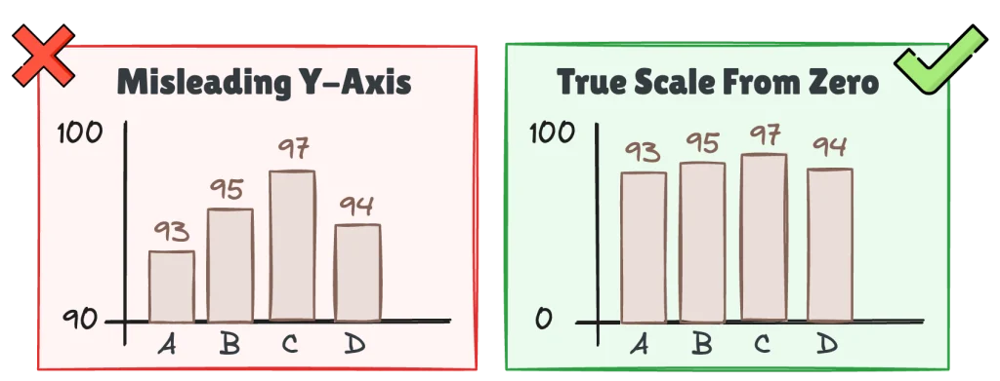

**Class date:** 

# How Visual Choices Can Change the Story

{fig-align="center"}\
<small>Source: <https://www.clicdata.com/blog/a-chart-chooser-for-bi-teams-stop-guessing-start-deciding/></small>

The wrong chart doesn’t just look bad, it changes what people believe the data says.

## Today’s goal

Last week, we focused on making the data analysis-ready. Today, we use the cleaned collision data to answer a different question:

> **Given a question and variable types, which chart should we choose, and how should we build it in R?**

```{r}
#| label: setup
#| include: false

library(dplyr)
library(ggplot2)
library(lubridate)
```

```{r, warning=FALSE}
library(tidyverse)
library(lubridate)
library(ggplot2)
library(ggalluvial)
library(dplyr)
```

# Load the cleaned data

We will continue with the dataset cleaned in the previous class.

```{r}
df_clean <- read.csv("data/nyc_collisions_2025_q1_clean.csv", header = T)
names(df_clean)
dplyr::glimpse(df_clean)
```

Let's restore useful variable types like this:

```{r}
df <- df_clean %>%
  mutate(crash_date = ymd(crash_date),
         crash_weekday = factor(crash_weekday,
                                levels = c("Monday", "Tuesday", "Wednesday",
                                           "Thursday", "Friday", "Saturday",
                                           "Sunday")),
         time_of_day = factor(time_of_day,
                              levels = c("Morning", "Afternoon", 
                                         "Evening", "Night")))
```

# How `ggplot2` builds a graph

Before choosing among many chart types, learn the basic logic of `ggplot2`. A graph is built **layer by layer**.

For this first example, we ask a simple question:

> **How many collisions occurred in each borough?**

We will build the same graph one step at a time.

## Step 1. Start with the data

```{r}
ggplot(df)
```

## Step 2. Map a variable to an aesthetic

```{r}
ggplot(df, aes(x = borough))
```

## Step 3. Add a geometry

```{r}
ggplot(df, aes(x = borough)) +
  geom_bar()
```

## Step 4. Change the appearance

```{r}
ggplot(df, aes(x = borough)) +
  geom_bar(fill = "steelblue")

ggplot(df, aes(x = borough)) +
  geom_bar(fill = "steelblue", colour = "black")
```

## Step 5. Add labels

```{r}
ggplot(df, aes(x = borough)) +
  geom_bar(fill = "steelblue", colour = "black") +
  labs(title = "Distribution of Motor Vehicle Collisions by Borough",
       x = "Borough", y = "Frequency")

ggplot(df, aes(x = borough)) +
  geom_bar(fill = "steelblue", colour = "black") +
  labs(title = "Distribution of Motor Vehicle Collisions by Borough",
       subtitle = "NYC Motor Vehicle Collisions in the cleaned dataset",
       x = "Borough", y = "Frequency")
```

## Step 6. Apply a theme

```{r}
ggplot(df, aes(x = borough)) +
  geom_bar(fill = "steelblue", colour = "black") +
  labs(title = "Distribution of Motor Vehicle Collisions by Borough",
       subtitle = "NYC Motor Vehicle Collisions in the cleaned dataset",
       x = "Borough", y = "Frequency") +
  theme_classic()
```

## Step 7. Clean the Plotting Data

```{r}
df.plot <- df %>%
  filter(!is.na(borough), borough != "")

ggplot(df.plot, aes(x = borough)) +
  geom_bar(fill = "steelblue", colour = "black") +
  labs(title = "Distribution of Motor Vehicle Collisions by Borough",
       subtitle = "NYC Motor Vehicle Collisions in the cleaned dataset",
       x = "Borough", y = "Frequency") +
  theme_classic()

df %>%
  filter(!is.na(borough), borough != "") %>%
  ggplot(aes(x = borough)) +
  geom_bar(fill = "steelblue", colour = "black") +
  labs(title = "Distribution of Motor Vehicle Collisions by Borough",
       subtitle = "NYC Motor Vehicle Collisions in the cleaned dataset",
       x = "Borough", y = "Frequency") +
  theme_classic()

ggplot(df %>% filter(!is.na(borough), borough != ""), aes(x = borough)) +
  geom_bar(fill = "steelblue", colour = "black") +
  labs(title = "Distribution of Motor Vehicle Collisions by Borough",
       subtitle = "NYC Motor Vehicle Collisions in the cleaned dataset",
       x = "Borough", y = "Frequency") +
  theme_classic()
```

## The basic structure

```{r, eval=FALSE}
ggplot(data, aes(x = ..., y = ...)) +
  geom_...() +
  labs(...) +
  theme_...()
```

| Component   | What does it do?                    | Example                    |
|-------------------|------------------------------|-----------------------|
| `ggplot()`  | Selects the data                    | `ggplot(collisions_clean)` |
| `aes()`     | Maps variables to visual properties | `aes(x = borough)`         |
| `geom_*()`  | Determines what is drawn            | `geom_bar()`               |
| `labs()`    | Adds titles and labels              | `labs(title = "...")`      |
| `theme_*()` | Controls overall appearance         | `theme_classic()`          |

### Cf. Mapping vs. setting

This distinction is one of the most important ideas in `ggplot2`.

- Setting: every bar gets the same color

```{r}
ggplot(df, aes(x = borough)) +
  geom_bar(fill = "steelblue")
```

`fill = "steelblue"` is **outside** `aes()`, so the color is fixed.

- Mapping: color is determined by a variable

```{r}
ggplot(df, aes(x = borough, fill = borough)) +
  geom_bar()

ggplot(df, aes(x = borough, fill = borough)) +
  geom_bar() +
  scale_fill_brewer(palette = "Set2") +
  guides("none")

# scale_fill_brewer(palette = "Set1")
# scale_fill_brewer(palette = "Set2")
# scale_fill_brewer(palette = "Pastel1")
# scale_fill_brewer(palette = "Dark2")
```

`fill = borough` is **inside** `aes()`, so color is driven by the data.

> **Inside `aes()` = mapped to data**\
> **Outside `aes()` = fixed setting**

# Choose the chart from the question

{fig-align="center"}\
<small>Source: <https://biuwer.com/en/blog/how-to-choose-the-right-chart-for-your-data/></small>

| Question Type | Example Question | Variable Types | Useful Chart |
|------------------|------------------|------------------|------------------|
| **Comparison** | How many collisions occurred in each borough? | One categorical variable | Bar chart |
| **Distribution** | How are injury counts distributed? | One numeric variable | Histogram |
| **Group Comparison** | Do injury counts differ by time of day? | Categorical + numeric | Box plot |
| **Trend** | How did collisions change over time? | Time + numeric/count | Line chart |
| **Relationship** | Is daily collision volume related to the number of injured persons? | Numeric + numeric | Scatterplot |
| **Two-Way Pattern** | What patterns appear across borough and time of day? | Categorical + categorical | Heatmap |
| **Flow** | How do collisions flow across borough, time of day, and injury severity? | Multiple categorical variables | Alluvial plot |


# One categorical variable: bar chart

## Question

**How many collisions occurred in each borough?**

First, inspect the counts.

```{r}
borough_counts <- df %>%
  filter(!is.na(borough), borough != "") %>%
  count(borough, sort = TRUE)

borough_counts
```

## Step 1. Start with the minimum

```{r}
ggplot(borough_counts, aes(x = borough, y = n)) +
  geom_col()
```

## Step 2. Add meaningful labels

```{r}
ggplot(borough_counts, aes(x = borough, y = n)) +
  geom_col() +
  labs(x = NULL,
       y = "Number of collisions",
       title = "Motor vehicle collisions by borough")
```

## Step 3. Order the categories

```{r}
ggplot(borough_counts,
       aes(x = reorder(borough, n), y = n)) +
  geom_col() +
  coord_flip() +
  labs(x = NULL,y = "Number of collisions",
       title = "Motor vehicle collisions by borough") +
  theme_minimal()
```

# One numeric variable: histogram

## Question

**How are injury counts distributed across collisions?**

First, inspect the variable.

```{r}
library(psych)
describe(df$injured)
```

Now visualize the distribution.

```{r}
ggplot(df, aes(x = injured)) +
  geom_histogram(binwidth = 1, boundary = -0.5) +
  labs(x = "Number of persons injured",
       y = "Number of collisions",
       title = "Distribution of injuries per collision") +
  theme_minimal()

# df %>% count(injured, sort = TRUE)
```

> **problem: the distribution is highly concentrated at zero**\

For exploratory purposes, we may want to inspect collisions involving at least one injury separately.

```{r}
df %>%
  filter(injured > 1) %>%
  ggplot(aes(x = injured)) +
  geom_histogram(binwidth = 1, boundary = 0.5) +
  labs(x = "Number of persons injured",
       y = "Number of collisions",
       title = "Injury counts among collisions with at least one injury") +
  theme_minimal()

ggplot(df, aes(x = crash_hour)) +
  geom_histogram(binwidth = 1, boundary = .5,
                 fill = "grey", colour = "black") +
  labs(title = "Distribution of Motor Vehicle Collisions by Hour",
       x = "Hour of Day", y = "Number of Collisions") +
  theme_light()
```


# Categorical + numeric: box plot

## Question

**Do injury counts differ across times of day?**

```{r}
ggplot(df, aes(x = time_of_day, y = injured)) +
  geom_boxplot() +
  labs(x = "",
       y = "Number of persons injured",
       title = "Injury counts by time of day") +
  theme_minimal()
```

The plot may be difficult to read because most values are zero. This is itself an important feature of the data.

We can complement the plot with group-wise summaries.

```{r}
df %>%
  filter(!is.na(time_of_day)) %>%
  group_by(time_of_day) %>%
  summarise(
    n = n(),
    mean_injured = mean(injured, na.rm = TRUE),
    median_injured = median(injured, na.rm = TRUE),
    severe_rate = mean(severe_collision, na.rm = TRUE)
  )

daily_time_counts <- df %>%
  filter(!is.na(crash_date), !is.na(time_of_day)) %>%
  count(crash_date, time_of_day, name = "collisions")

daily_time_counts

ggplot(daily_time_counts,
       aes(x = time_of_day, y = collisions,
           fill = time_of_day)) +
  geom_boxplot(width = 0.65, alpha = 0.75) +
  guides(fill = "none") +
  labs(x = "", y = "Number of collisions per day",
       title = "Daily Collision Counts by Time of Day") +
  theme_minimal()
```

# Time: line chart

## Question

**How did the number of collisions change from day to day?**

First aggregate the collision-level data into daily counts.

```{r}
daily_collisions <- df %>%
  filter(!is.na(crash_date)) %>%
  count(crash_date)

head(daily_collisions)
```

Then draw the time series.

```{r}
ggplot(daily_collisions, aes(x = crash_date, y = n)) +
  geom_line() +
  labs(x = "", y = "Number of collisions",
       title = "Daily motor vehicle collisions") +
  theme_minimal()

ggplot(daily_collisions, aes(x = crash_date, y = n)) +
  geom_line(colour = "grey75",
            linewidth = 0.35,alpha = 0.6) +
  geom_smooth(method = "lm", se = F,
              colour = "steelblue", linewidth = 1.1) +
  labs(title = "Daily Motor Vehicle Collisions in NYC",
       subtitle = "Daily variation and overall trend",
       x = "", y = "Number of collisions") +
  theme_classic()
```

::: callout-note
## Why aggregate first?

The raw dataset has one row per collision. A line chart of daily collision counts requires one row per day, so we first transform the data to the level required by the chart.
:::

# Numeric + numeric (relationship): scatterplot

## Question

**How is daily collision volume related to the number of injured persons?**

```{r}
daily_summary <- df %>%
  filter(!is.na(crash_date), !is.na(injured)) %>%
  group_by(crash_date) %>%
  summarise(collisions = n(),
            total_injured = sum(injured, na.rm = TRUE),
            .groups = "drop") %>%
  mutate(weekday = wday(crash_date,
                        label = TRUE,
                        abbr = FALSE,
                        week_start = 1),
         day_type = if_else(weekday %in% c("Saturday", "Sunday"),
                            "Weekend",
                            "Weekday"))

ggplot(daily_summary, aes(x = collisions,
                          y = total_injured)) +
  geom_point(alpha = 0.5,size = 2.5) +
  labs(title = "Daily Collision Volume and Injuries",
       subtitle = "Each point represents one day",
       x = "Number of Collisions",
       y = "Number of Persons Injured") +
  theme_minimal()

ggplot(daily_summary, aes(x = collisions,
                          y = total_injured,
                          colour = day_type)) +
  geom_point(alpha = 0.5,size = 2.5) +
  labs(title = "Daily Collision Volume and Injuries",
       subtitle = "Each point represents one day",
       x = "Number of Collisions",
       y = "Number of Persons Injured",
       colour = "Day Type") +
  theme_minimal()
```


# Improving a chart: ask what the viewer needs

A good chart should make the intended comparison easy to see.

When refining a figure, check:

- Is the chart type appropriate for the question?
- Are categories ordered meaningfully?
- Are the axis labels understandable?
- Does the title state what is being shown?
- Are unnecessary elements distracting attention?
- Have we accidentally hidden important cases by filtering?
- Does the chart imply more than the data support?

## Example: from default output to communication-ready output

```{r}
borough_counts %>%
  ggplot(aes(x = reorder(borough, n), y = n)) +
  geom_col() +
  coord_flip() +
  labs(x = "", y = "Number of collisions",
       title = "Brooklyn recorded the most collisions in the selected period", subtitle = "NYC Motor Vehicle Collisions"
  ) +
  theme_minimal()
```

::: callout-warning
## Be careful with claim-like titles

A title such as “Brooklyn is the most dangerous borough” would go beyond what this chart shows. The data show the number of recorded collisions, not overall danger or individual risk.
:::

# Cf. Advanced showcase: what else can R visualize?

## Alluvial plot: showing flows across categories (sankey plot)

An alluvial plot is useful when the goal is to show how observations are distributed across **several categorical variables at the same time**.

```{r}
flow_data <- df %>%
  mutate(
    collision_outcome = case_when(
      killed > 0 ~ "Fatality",
      injured > 0 ~ "Injury",
      TRUE ~ "No injury"
    )
  ) %>%
  filter(
    !is.na(borough_display),
    borough_display != "Unknown",
    !is.na(time_of_day)
  ) %>%
  count(borough_display, time_of_day, collision_outcome)

head(flow_data)
```

```{r}
ggplot(
  flow_data,
  aes(
    axis1 = borough_display,
    axis2 = time_of_day,
    axis3 = collision_outcome,
    y = n
  )
) +
  geom_alluvium(aes(fill = borough_display), alpha = 0.65) +
  geom_stratum(width = 0.18, fill = "grey95", colour = "grey40") +
  geom_text(
    stat = "stratum",
    aes(label = after_stat(stratum)),
    size = 3
  ) +
  scale_x_discrete(
    limits = c("Borough", "Time of day", "Outcome"),
    expand = c(.06, .06)
  ) +
  labs(
    x = NULL,
    y = "Number of collisions",
    title = "How collisions flow across place, time, and outcome"
  ) +
  guides(fill = "none") +
  theme_minimal()
```

::: callout-warning
## Impressive does not always mean better

Alluvial plots can become difficult to read when there are too many categories. Use them when the **flow itself** is the message, not simply because the chart looks sophisticated.
:::
